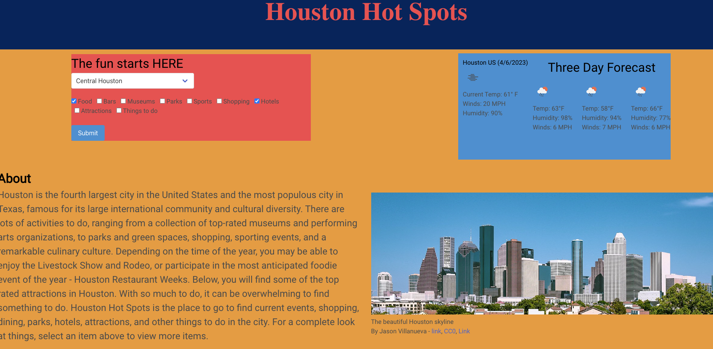
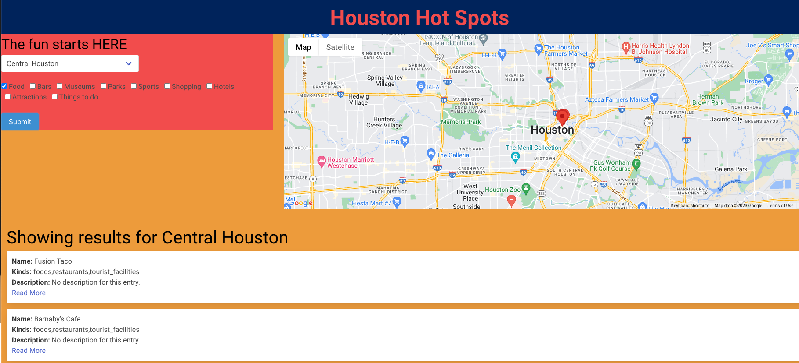

# Team Project - Houston Hot Spots

## Description

The purpose of this project was to build an application that allows a user to select an area in Houston 
and a category of things to do, and be presented with a list of options, information on the options, and a map with their location.

## Table of Contents 

- [Tasks Completed](#TasksCompleted)
- [Installation](#installation)
- [Usage](#usage)
- [Tools](#tools)
- [Credits](#credits)
- [References](#references)
- [License](#license)

## Tasks Completed

* set up OpenTripMap API URL and API key to fetch data
* added event listener to submit button to loop through selections and store the   values in an array
* set up OpenWeatherMap URL and API key to fetch weather data
* extracted weather data and displayed it on the page 
* set up GoogleMaps API and API key to fetch data
* extracted maps data and dislayed it on the page
* used Bulma CSS library to stylize the site
* created html with various sections and added images and content

## Installation

* Get a free API Key at https://opentripmap.com, https://openweathermap.org, and https://maps.googleapis.com
* Clone the repository into your local machine
        git clone git@github.com:jomaduagwu/team-project.git
* Enter API Key in index.js and display-search.js files
        var apiKey = "Enter your API Key";

## Usage

The layout of this application is optimized for different screen sizes.

Link to deployed website - https://jomaduagwu.github.io/project-houston-hot-spots/

## Tools

- Open Trip Map API - https://opentripmap.com/
- Open Weather Map API - https://openweathermap.org/
- Google Maps API - https://maps.googleapis.com/

## Credits

* [Phillip Pfister](https://github.com/Phil-Pfister)
* [Callistus Nguyen](https://github.com/cnguyen1013)
* [Jochebed Maduagwu](https://github.com/jomaduagwu)

## References

* [MDN Docs](https://developer.mozilla.org/en-US/)
* [Bulma Docs](https://bulma.io/documentation/)
* [Open Trip Map API](https://opentripmap.io/docs)
* [Open Weather API](https://openweathermap.org/api)
* [W3 schools](https://www.w3schools.com/)
* [Google maps](https://developers.google.com/maps/documentation/javascript)
* [Wikipedia](www.wikipedia.org) images and text content

## License

Distributed under the MIT License. Please refer to the LICENSE in the repo for more information. 

## Badges

N/A

## Features

N/A

## Tests

N/A
